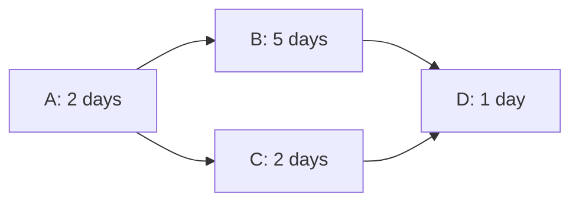

# Critical path marking: implementation concept

Status: proposed design; no runtime changes are included in this document.

Baseline: repository commit `1cef44a`, inspected on 2026-09-07, including the grid/timeline resizer and column-header sorting changes. Paths below are relative to the plugin root. The primary target is the task chart reached through `TaskGanttController::show()` and rendered into `#dhtmlx-gantt-chart`.

## 1. Existing implementation and design decisions

Implement a browser-side Critical Path Method (CPM) calculation over a normalized, project-scoped dependency graph. Keep the calculation independent of DHtmlX rendering and task persistence. Highlight every task with zero total float and every driving dependency between critical tasks, including multiple equally long parallel paths.

The bundled `Assets/dhtmlxgantt.js` identifies itself as **DHtmlX Gantt 9.0.15 Standard, GPL 2.0**. It contains rendering hooks that reference `highlight_critical_path`, `isCriticalTask`, and `isCriticalLink`, but does not provide the critical path extension implementation. Setting a config property alone will not implement this feature. Use a custom CPM module with the existing library; purchasing or replacing the library is outside this design.

### 1.1 Relevant code already present

| File and entry point | Existing behavior | Consequence for implementation |
| --- | --- | --- |
| `Assets/dhtmlx-init.js`: `initDhtmlxGantt()` | Sets date format `%Y-%m-%d %H:%i`, enables links, installs bar and tooltip templates. | Integrate configuration here. Modify the active implementation, not the large commented-out implementation at the start of the file. |
| `Assets/dhtmlx-init.js`: `loadGanttData(data)` | Already passes `data.data` and `data.links` to `gantt.parse()`. Schedules `recalcAllParentDurations()` afterward. | Dependency transport exists. Add analysis-state ingestion and explicit recalculation after the load batch. |
| `Assets/dhtmlx-init.js`: `setupGanttEventHandlers()` | Persists edits through `fetch()` event handlers. Contains `reloadGanttDataFromServer()` as a nested function. | Do not add a second data processor. Hook the existing fetch success, failure, and reload paths. Expose a deliberate refresh callback if a separate module needs it. |
| `Plugin.php`: `initialize()` | Registers routes, access rules, formatter factories, and global asset hooks. Loads `dhtmlx-init.js`, then `gantt.js`; CSS ends with `gantt-csp-fix.css`. | Register the new module and styles in a defined order. Add explicit viewer access for `TaskGanttController::getData()`. |
| `Formatter/TaskGanttFormatter.php`: `format()` | Skips closed tasks and tasks whose `column_name` equals `Done`, emits subtasks and grouping summaries, returns `{data, links}`. | Preserve the chart's completion convention, but calculate against an unfiltered project analysis dataset. |
| Same formatter: `formatLinks()` | Already joins `task_has_links` to `links`, maps both blocking labels to FS arrows, and applies `sameLevelAllowed()`. | Replace repeated queries, deduplicate reciprocal links, restrict endpoints correctly, and remove hierarchy-based omission of real dependencies. |
| `Controller/TaskGanttController.php`: `show()`, `getData()` | Builds a project-filtered task query using the search expression and sorting. | Return the same envelope for initial HTML and JSON reloads, including the complete analysis graph. |
| Same controller: `dependency()`, `addDependency()`, `removeDependency()` | Provides existing dependency writes, with inconsistent validation. | Keep one canonical dependency write implementation and reuse graph normalization for cycle validation. |
| `Template/task_gantt/show.php` | Embeds the formatted envelope in escaped `data-tasks`; provides toolbar and data URLs. | Add the toggle, legend/status text, and consistent reload parameters. |
| `Assets/gantt.js`: `initKanboardGanttExtensions()` | Assigns `task_class` and `tooltip_text` again and registers another link validator. | Consolidate template/validation ownership. A change only in `dhtmlx-init.js` can be overwritten on normal startup. |
| `Assets/gantt.css`, `Assets/gantt-csp-fix.css` | Apply category, milestone, sprint, workload, and dark-mode styles, often with `!important`. | Add deliberately scoped overrides after these files and address the arrow-fixing JavaScript. |

The separate `ProjectGanttController::tasks()` / `Formatter/ProjectGanttFormatter.php` / `Template/project_gantt/show.php` flow uses another chart container and formatter. Do not assume changes to the task formatter automatically cover that screen. The initial release covers the main task chart; a later extension can reuse the graph service and CPM module there.

### 1.2 Scheduling semantics for the first release

These decisions form the feature's contract and must be represented in tests and help text:

- **Scope:** all eligible, unfinished tasks in the current project, including tasks hidden by a search. Collapsing, sorting, grouping, and searching change presentation, not project float. Cross-project dependencies are outside the calculation; label the result as project-scoped rather than an organization-wide delivery forecast.
- **Dependencies:** finish-to-start (FS), zero lag only. `A blocks B` means B cannot start before A finishes. Parent/child, related, duplicate, and other Kanboard relations do not imply precedence.
- **Dates:** use stored scheduled intervals. A task's scheduled start is a release bound, meaning it cannot start earlier in the analysis. Its scheduled end determines its duration, not a hard finish deadline. This is CPM with start constraints, so moving an independent task later can change the project finish and critical set.
- **Calendar:** seven-day, continuous calendar time, at minute precision. Weekends count. Keep `gantt.config.work_time = false` and the chart's existing day-based duration display. Resource capacity, holidays, leads/lags, hard deadlines, and remaining-effort estimation are deferred.
- **Meaning of float:** how far an activity could be delayed from its earliest feasible position before it delays the calculated project finish. This is not necessarily the gap to the next bar or the time until its Kanboard due date.
- **Effect on data:** calculation and highlighting never reschedule tasks, change category colors in stored data, or invoke `save()`. The existing move-dependencies option remains an independent edit feature.

This definition is intentional: a pure duration-only longest path that ignores scheduled starts would not react to many date drags, while treating every due date as a hard constraint would produce a different deadline/negative-float analysis.

## 2. Detecting the critical path and float

### 2.1 Select actual activities

Build analysis membership from server records, not DOM nodes or the rendered tree. Add explicit fields such as `entity_kind` (`task`, `milestone`, `sprint`, `subtask`, `group`) and `analysis_eligible` to distinguish real records from presentation rows.

| Record | Analysis treatment |
| --- | --- |
| Open ordinary Kanboard task outside `Done` | One activity, even if it has Kanboard subtasks or is nested beneath another real task. |
| Real milestone task (`is_milestone` or `task_type === 'milestone'`) | Zero-duration event, at its stored due date if available, otherwise its stored start. |
| Sprint (`task_type === 'sprint'`) | Summary only; exclude its duration so children are not counted twice. |
| Generated assignee/category/sprint group | Summary only; exclude. Generated IDs must not collide with Kanboard IDs. |
| Native Kanboard subtask (`subtask_123`) | Exclude: this formatter invents its dates, and native task links address tasks, not subtasks. The parent task is the scheduling activity. |
| Closed task or task in a `Done` column | Exclude as completed; its outgoing blocking condition is considered satisfied. Do not infer completion from `progress >= 1`, since progress is not the formatter's completion rule. |

An ordinary task with children is still an activity unless it is explicitly a sprint/summary. Do not use `gantt.hasChild()` as the eligibility test.

Keep hierarchy relations separate from the dependency graph. If existing blocking links target an unfinished sprint/summary, report that unsupported endpoint and mark analysis unavailable until the dependency is attached to an actual activity. Silently dropping such a constraint could produce a false critical path.

The existing milestone UI deliberately uses rectangular bars, often with a minimum one-day duration. Preserve that presentation initially, but calculate the milestone as an event at the defined timestamp, and show that timestamp in its tooltip. Do not count the artificial bar width as work. A future conversion to `gantt.config.types.milestone` should be a separate presentation decision.

### 2.2 Normalize dates without formatter fallbacks

`TaskGanttFormatter::formatTask()` currently substitutes `time()` when `date_started` is missing, substitutes one day when `date_due` is missing, and `calculateDuration()` rounds up with a minimum of one day. These are display fallbacks, not reliable planning inputs.

Include validated analysis dates separately from the display fields. For an ordinary activity require a real start and end with `end > start`. For a milestone require its event timestamp. Missing or invalid dates on any eligible activity make the project calculation unavailable, with a count and accessible task references for correction. Leave the chart usable and clear any previous critical classes; do not label the other tasks non-critical using an incomplete graph. A searched-out invalid task still affects availability.

Use the same server-formatted calendar dates as the chart. Convert them to integer civil minutes rather than dividing local JavaScript timestamps by `86400000`:

```js
// Input follows the server/chart contract YYYY-MM-DD HH:mm.
// UTC is used as a calendar-coordinate system, not a timezone conversion.
function civilMinute(value) {
    const match = /^(\d{4})-(\d{2})-(\d{2}) (\d{2}):(\d{2})$/.exec(value);
    if (!match) throw new Error('Invalid analysis date');
    const [year, month, day, hour, minute] = match.slice(1).map(Number);
    const date = new Date(Date.UTC(year, month - 1, day, hour, minute));
    if (date.getUTCFullYear() !== year || date.getUTCMonth() !== month - 1 ||
        date.getUTCDate() !== day || date.getUTCHours() !== hour ||
        date.getUTCMinutes() !== minute) {
        throw new Error('Invalid analysis date');
    }
    return date.getTime() / 60000;
}
```

Parse canonical server analysis strings directly as above so a daylight-saving transition in the browser's timezone cannot shift them. For local edits, format the task's parsed dates with `gantt.date.date_to_str(gantt.config.date_format)` and feed those strings to the same helper. This avoids 23/25-hour daylight-saving days corrupting day-sized activities, and avoids browser-specific string parsing. The existing server-local, timezone-free date convention remains in force; timestamps with explicit timezones would require a separate date-contract change.

Set project origin `O` to the minimum activity start/event minute. For an ordinary activity i:

```text
R[i] = scheduledStart[i] - O       // start release bound
d[i] = scheduledEnd[i] - scheduledStart[i]
```

For a milestone use `R[i] = eventMinute[i] - O` and `d[i] = 0`. Use integer minutes throughout; show days as `minutes / 1440` only in formatted output. Do not use the rounded PHP `duration`, `time_estimated`, progress percentage, or sprint span as the CPM duration. `gantt.calculateDuration()` and `gantt.calculateEndDate()` remain appropriate for existing chart display operations, but the analysis must follow this explicitly defined calendar.

### 2.3 Construct and validate a directed acyclic graph

Add `Assets/critical-path.js` exposing a pure `KanboardCriticalPath.calculate(nodes, links)` function. Normalize task and link lookup keys to strings; use `Map`/`Set` for constant-time access.

Build `predecessors[id]`, `successors[id]`, and `indegree[id]` in one pass over deduplicated FS links. Reject self-links, unknown endpoints within the declared analysis graph, and unsupported dependency types. Treat exclusions such as completed tasks using the server membership policy before building this graph.

Use Kahn's topological sort with a queue and a head index. If fewer than V vertices are emitted, the graph contains a cycle. Return `status: 'cycle'` and no critical result. Kahn's remaining vertices can include tasks downstream of a cycle: use a DFS with a recursion-stack marker, or strongly connected components, to identify an actual cycle for the message. A visited set alone is not sufficient cycle detection.

Server creation validation must also check reachability from the proposed target to the proposed source. Existing data can have been created outside this plugin, so browser validation alone cannot establish acyclicity.

### 2.4 Forward and backward passes

For topological order `order`:

```text
for i in order:
    ES[i] = max(R[i], max(EF[p] for p in predecessors[i]))
    EF[i] = ES[i] + d[i]

F = max(EF[i] for every activity i)

for i in reverse(order):
    LF[i] = min(LS[s] for s in successors[i]) if successors exist else F
    LS[i] = LF[i] - d[i]
    TF[i] = LS[i] - ES[i]
    FF[i] = min(ES[s] for s in successors[i]) - EF[i] if successors exist else F - EF[i]
```

The empty predecessor maximum does not constrain `R[i]`. `F` is one common project finish across all disconnected components and all terminal tasks. This is equivalent to adding a zero-duration virtual finish connected to every sink. Do not compute a separate finish per branch or connected component: doing that incorrectly marks each short branch critical.

`ES`/`EF` mean earliest start/finish; `LS`/`LF` mean latest start/finish without moving F; `TF` is total float and `FF` is free float. Integer arithmetic makes `TF === 0` an exact test. If later calendars introduce fractional units, introduce one documented tolerance; do not equate rounded display text such as `0.0 days` with zero float.

A task is critical when `TF[i] === 0`. A dependency `u -> v` is critical only when:

```text
TF[u] === 0 && TF[v] === 0 && EF[u] === ES[v]
```

The equality checks that this edge is driving the successor. Two zero-float tasks can be connected by a redundant edge with a gap; that edge must remain non-critical. Retain all ties. Do not choose one predecessor while backtracking a single longest chain, and do not enumerate every possible path.

A start constraint can itself drive a critical activity. For example, a late independent task may have no critical incoming dependency. The tooltip can show `Start constraint drives earliest start` when `R[i] > max(EF[p])`.

Use `ES[i] > R[i]` to flag that the displayed start precedes the dependency-feasible start. Return that scheduling conflict separately. The calculated finish is a feasible forecast under these constraints; the visual bars remain at their stored dates. An overdue task or a violated displayed dependency is not automatically critical. Without a separate hard deadline, negative total float indicates invalid input or an implementation error, not an ordinary result.

### 2.5 Worked parallel-path example

The numbers below are calendar days for readability; implementation uses minutes. Let scheduled starts be A=0, B=2, C=2, and D=7.



| Task | Duration | ES | EF | LS | LF | Total float | Free float | Critical |
| --- | ---: | ---: | ---: | ---: | ---: | ---: | ---: | --- |
| A | 2 | 0 | 2 | 0 | 2 | 0 | 0 | Yes |
| B | 5 | 2 | 7 | 2 | 7 | 0 | 0 | Yes |
| C | 2 | 2 | 4 | 5 | 7 | 3 | 3 | No |
| D | 1 | 7 | 8 | 7 | 8 | 0 | 0 | Yes |

F=8. Highlight A, B, D and arrows A→B, B→D. C can slip three days without changing project completion. If C's duration becomes five days, both parallel branches and all four arrows are critical. If an isolated task E starts at 0 and lasts three days, it has five days of float against the same F=8.

No tasks produces an `empty` result. An all-milestone graph can validly have F=0. An unlinked project can still have a critical latest-finishing activity; show `No dependencies; result is based on scheduled activity finishes` so users understand the basis.

## 3. Dependency data: Kanboard to DHtmlX

### 3.1 Storage and orientation

The plugin already uses these Kanboard tables:

```text
tasks:          id, project_id, date_started, date_due, is_active, column_id, ...
task_has_links: id, task_id, opposite_task_id, link_id
links:          id, label, opposite_id
```

Interpret a relation label from the perspective of `task_has_links.task_id`:

| Stored relation | DHtmlX source | DHtmlX target | Type |
| --- | --- | --- | --- |
| A `blocks` B | A | B | `"0"` (FS) |
| B `is blocked by` A | A | B | `"0"` (FS) |
| A `is a parent of` B / B `is a child of` A | No dependency | No dependency | Hierarchy only |

Standard Kanboard task-link operations maintain opposite relations. The loader must handle both reciprocal records and a single directional record without emitting duplicate arrows. Normalize to `(source, target, type)` and deduplicate by that tuple, not by database row ID. Keep distinct directed pairs distinct.

Do not hardcode numeric link-type IDs. Resolve `blocks` and `is blocked by` once per request from the `links` catalog and check their `opposite_id` pairing. Labels are stored relation definitions, not `t()` translations. If an installation renamed them, support an explicit configuration mapping to those IDs; do not guess that another relation means blocking. A missing mapping is an unavailable-analysis state, not proof that the project has no dependencies.

Kanboard core and a live database are not included in this checkout, and upstream retrieval was unavailable during this inspection. The schema usage above is grounded in the plugin's queries; confirm the installed core's reciprocal `TaskLinkModel::create()` / `remove()` behavior and `links.opposite_id` schema in PR 1's integration fixtures before relying on pair deletion.

### 3.2 Bulk query and shared normalization

Add `Model/GanttDependencyModel.php`, extending `Kanboard\Core\Base`, and register a `ganttDependencyModel` factory in `Plugin::initialize()`. Suggested methods:

- `getDependencyTypeIds()` resolves and validates the configured catalog pair.
- `getProjectDependencyRows(int $projectId)` fetches raw project relations in bulk.
- `normalizeDependencyRows(array $rows, array $typeIds)` orients and deduplicates the rows.
- `wouldCreateCycle(array $edges, int $source, int $target)` checks directed reachability for writes.

Equivalent parameterized SQL for project-internal dependencies:

```sql
SELECT thl.id AS relation_id,
       thl.task_id,
       thl.opposite_task_id,
       thl.link_id,
       l.label,
       l.opposite_id
FROM task_has_links AS thl
JOIN links AS l ON l.id = thl.link_id
JOIN tasks AS source_record ON source_record.id = thl.task_id
JOIN tasks AS opposite_record ON opposite_record.id = thl.opposite_task_id
WHERE source_record.project_id = :project_id
  AND opposite_record.project_id = :project_id
  AND thl.link_id IN (:blocks_id, :blocked_by_id);
```

Use distinct bound placeholders if the database driver requires one per occurrence. Project identity comes from `$this->getProject()`, not a client-supplied task list. Both project predicates are required regardless of stored orientation.

For the formatter's already-authorized project task IDs, the existing PicoDb style can also be used:

```php
// $projectTaskIds includes all project tasks before completion/search filtering.
// Return early when it is empty; bound/chunk large IN lists for the DB driver.
$rows = $this->db->table('task_has_links')
    ->join('links', 'id', 'link_id')
    ->columns(
        'task_has_links.id AS relation_id',
        'task_has_links.task_id',
        'task_has_links.opposite_task_id',
        'task_has_links.link_id',
        'links.label'
    )
    ->in('task_has_links.task_id', $projectTaskIds)
    ->in('task_has_links.opposite_task_id', $projectTaskIds)
    ->in('task_has_links.link_id', $dependencyTypeIds)
    ->findAll();
```

The SQL and PicoDb examples are alternatives, not two queries to run. After normalization, retain the smallest underlying relation ID as the stable numeric DHtmlX `id`. Prefer this over a synthetic `source-target` ID because the current deletion endpoint expects a database relation ID. Keep both row IDs internally if needed for validation/diagnostics; do not accept a browser-supplied list of row IDs as deletion authority.

Query once for the task records used to construct analysis membership, for example:

```sql
SELECT t.id, t.project_id, t.date_started, t.date_due, t.is_active,
       c.title AS column_name
FROM tasks AS t
JOIN columns AS c ON c.id = t.column_id
WHERE t.project_id = :project_id;
```

Read `task_type` and `is_milestone` metadata in bulk for these IDs using the installed Kanboard metadata model/table (`task_has_metadata`, fields `task_id`, `name`, `value` in standard Kanboard). Preserve the current case-insensitive `Done` check in application code. Keep excluded task IDs/reasons long enough to distinguish a satisfied completed predecessor from an invalid or unsupported endpoint.

Refactor `TaskGanttFormatter::formatLinks()` to accept the prepared normalized graph and actual emitted activity ID set. It currently re-executes `$this->query->findAll()` and collects IDs before `format()`'s closed/Done exclusions, which can leave links pointing to absent rows. Replace `self::$ids` with a per-format-call set, or reset it explicitly: rendering twice in the same request must not suppress records.

Remove `sameLevelAllowed()` from dependency **loading**. Real precedence may cross parent tasks, categories, assignees, or sprints. Keep `buildParentMap()` / `resolveParentId()` for hierarchy only. No CPM vertex or edge should be inferred from the visual `parent` property.

### 3.3 Payload and filter semantics

Extend the existing envelope; avoid a separate request on every toggle. Example for two visible tasks:

```json
{
  "data": [
    {"id": 101, "text": "Design", "start_date": "2026-09-07 00:00", "end_date": "2026-09-09 00:00", "entity_kind": "task", "analysis_eligible": true},
    {"id": 102, "text": "Build", "start_date": "2026-09-09 00:00", "end_date": "2026-09-14 00:00", "entity_kind": "task", "analysis_eligible": true}
  ],
  "links": [{"id": 501, "source": 101, "target": 102, "type": "0"}],
  "analysis": {
    "version": 1,
    "scope": "project_open_tasks",
    "calendar": "civil_minutes_7d",
    "nodes": [
      {"id": 101, "kind": "task", "start": "2026-09-07 00:00", "end": "2026-09-09 00:00"},
      {"id": 102, "kind": "task", "start": "2026-09-09 00:00", "end": "2026-09-14 00:00"}
    ],
    "links": [{"id": 501, "source": 101, "target": 102, "type": "0"}],
    "issues": []
  }
}
```

`data` and top-level `links` are the display subset; include a visual link only if both endpoints are emitted activities. `analysis.nodes` and `analysis.links` contain the complete eligible project graph regardless of search. The duplication is deliberate and small at this scale. Hidden analysis nodes need only IDs, kind, and dates; do not duplicate descriptions, assignees, or other task content unnecessarily.

Add a shared controller helper, for example `buildGanttPayload($project, $search, $sorting, $groupBy)`, and use it in both `show()` and `getData()`. Apply project authorization before either query. Return analysis input issues with codes such as `missing_dates`, `invalid_interval`, `unsupported_endpoint`, or `dependency_mapping_missing`; the browser must not calculate a partial result when one is blocking.

The existing template's `data-tasks` escaping can transport this envelope unchanged. In `loadGanttData(data)`, retain `data.analysis` in the analysis controller, then pass **only** `{data: data.data, links: data.links}` to `gantt.parse()`. Store calculated output in separate maps, not persistent task properties:

```text
result = {
  status: 'ok' | 'empty' | 'invalid' | 'cycle',
  finishMinute,
  taskMetrics: Map<string, {es, ef, ls, lf, totalFloat, freeFloat, critical}>,
  criticalLinkIds: Set<string>,
  issues: [...]
}
```

Store origin with the result so metric offsets can be converted back to calendar dates. Analysis membership also provides the reliable way to identify excluded rows in templates.

Add an explicit route `dhtmlgantt/:project_id/data` for `getData()` and a `Role::PROJECT_VIEWER` access-map entry in `Plugin.php`. The existing query-string helper URL can continue to work; a pretty route is convenience, not a prerequisite for JSON. Include current `search`, `sorting`, and `group_by` in the template's reload URL so saving a task does not reset the visible filter.

### 3.4 Grouping and link write consistency

`groupByAssignee()`, `groupByUserGroup()`, and `groupBySprint()` currently rebuild partial task objects and call `gantt.parse({data: groupedData, links: []})`. They discard dependencies and task metadata; `clearGrouping()` can restore an old `originalTasks` snapshot. These paths must be corrected before releasing highlighting:

- Keep one latest canonical task/link envelope, replacing it after every accepted server reload.
- Generate groups from that envelope, clone complete task objects, change only presentation `parent`/group fields, and retain links with existing real endpoints.
- Use namespaced group IDs such as `group:assignee:42`, not the current `10000` starting value, which can collide with real task IDs.
- Preserve analysis state independently of grouping. Do not run multiple grouping strategies over already-grouped data. Do not require the optional `gantt.groupBy()` extension: use one supported grouping path consistently.

For dependency editing, update the two frontend validators (`onLinkValidation` in `dhtmlx-init.js` and `onBeforeLinkAdd` in `gantt.js`) to share one validator that allows cross-hierarchy real activities, rejects summaries/native subtasks/self-links, and requires `String(link.type) === gantt.config.links.finish_to_start`. DHtmlX's other constants are `"1"`=SS, `"2"`=FF, `"3"`=SF.

This restriction fixes a specific contract hazard: `TaskGanttController::dependency()` currently interprets `type === '1'` as a parent/child relationship. Split hierarchy creation into the explicit `type: 'child'` contract or a dedicated method, update its callers, and reject unsupported numeric scheduling types at the server. Do not silently turn an SS arrow into hierarchy or FF/SF into FS.

Make `addDependency()` delegate to the validated implementation or retire its route after checking callers. Its placeholder `parent_id` checks and direct reverse-link check do not provide graph validation. Replace `wouldCreateCircularDependency()` / `getAllDependentTasks()` with directed traversal of normalized edges: the current traversal mixes both relation labels and relies on `taskLinkModel->getAll()` row semantics.

For writes, keep `taskLinkModel->create($source, $target, $blocksId)` and `taskLinkModel->remove($relationId)` so Kanboard owns reciprocal records/events. Before deletion, load the relation, validate its blocking type, and verify both endpoint tasks belong to the authorized project. Remove the frontend's arbitrary `id > 1000000` rejection; explicitly track temporary links as pending instead. On duplicate creation, return/reload the existing canonical link.

On success, the current reload can supply the canonical database ID. On failure, restore or reload the authoritative graph and recalculate: the current delete-failure path leaves an arrow absent locally, and create-failure cleanup uses `gantt.silent()`, which bypasses normal invalidation events. Pending mutations must not leave a stale definitive critical result.

## 4. Visual rendering and DHtmlX integration

### 4.1 Configuration and template ownership

Load `Assets/critical-path.js` after the vendor library and before `Assets/dhtmlx-init.js`. It should define calculation/adapter functions without initializing a chart. Keep all feature setup guarded by the presence of `#dhtmlx-gantt-chart` because plugin assets are registered globally.

In `initDhtmlxGantt()` make the relevant configuration explicit:

```js
gantt.config.show_links = true;
gantt.config.work_time = false;
gantt.config.smart_rendering = true; // Already the bundled library's default.
gantt.config.highlight_critical_path = false; // Custom renderer owns highlighting.
// Keep existing drag_links permission behavior; highlighting does not grant edits.
```

Do not call `gantt.plugins({critical_path: true})`, `gantt.isCriticalTask()`, `gantt.isCriticalLink()`, or `gantt.getTotalSlack()` in the Standard implementation. Those are relevant to a separate Pro integration, whose scheduling semantics would need comparison with this contract. Do not enable auto-scheduling as part of the toggle.

Consolidate `task_class`, `tooltip_text`, and related templates into one installation function owned by `dhtmlx-init.js`; remove the competing assignments from `Assets/gantt.js`. Preserve existing milestone, sprint, priority, readonly, and workload classes, then append the critical-state class. Similarly extend `gantt.templates.link_class`:

```js
// cp is the per-chart analysis controller; these methods only read cached results.
gantt.templates.task_class = function (start, end, task) {
    return [baseTaskClass(start, end, task), cp.taskClass(task.id)]
        .filter(Boolean).join(' ');
};
gantt.templates.link_class = function (link) {
    return cp.linkClass(link.id);
};
```

Return `cp-critical-task` / `cp-noncritical-task` for eligible tasks only when highlighting is enabled and result status is `ok`. Return `cp-critical-link` / `cp-noncritical-link` for supported visible dependency links. Summary and native subtask rows receive neither class. Optionally mark a collapsed summary with `contains-critical-task` and a text badge, but never assign it zero float.

Append escaped tooltip fields for `Critical path: Yes/No`, total float, free float, and earliest feasible dates. Label excluded rows `Not analyzed` and unavailable results with their reason. Add a textual critical indicator through the configurable grid columns or a status badge so color is not the only signal. The dynamic column system uses `allAvailableColumns`; integrate there rather than replacing `gantt.config.columns` wholesale.

### 4.2 Bar colors and existing CSS conflicts

Add `Assets/critical-path.css` and load it **after** `Assets/gantt-csp-fix.css` in `Plugin.php`. Scope every rule to the chart's `cp-enabled` class. Use red for critical fill in light mode, orange in dark mode, and muted slate for non-critical activities. Keep a readable progress overlay and text.

Illustrative rules, including the CSS variables used by the bundled v9 renderer:

```css
#dhtmlx-gantt-chart.cp-enabled .gantt_task_line.cp-critical-task {
    --dhx-gantt-task-background: #dc2626 !important;
    --dhx-gantt-task-progress-color: #991b1b !important;
    --dhx-gantt-task-color: #ffffff !important;
    background: #dc2626 !important;
    outline: 2px solid #991b1b;
}
#dhtmlx-gantt-chart.cp-enabled .gantt_task_line.cp-noncritical-task {
    --dhx-gantt-task-background: #cbd5e1 !important;
    --dhx-gantt-task-progress-color: #94a3b8 !important;
    --dhx-gantt-task-color: #111827 !important;
    background: #cbd5e1 !important;
}
body.gantt-dark-mode #dhtmlx-gantt-chart.cp-enabled .gantt_task_line.cp-critical-task {
    --dhx-gantt-task-background: #fb923c !important;
    --dhx-gantt-task-progress-color: #ea580c !important;
    --dhx-gantt-task-color: #111827 !important;
    background: #fb923c !important;
    outline-color: #fdba74;
}
#dhtmlx-gantt-chart.cp-enabled .gantt_task_line.cp-critical-task .gantt_task_content,
#dhtmlx-gantt-chart.cp-enabled .gantt_task_line.cp-noncritical-task .gantt_task_content {
    color: var(--dhx-gantt-task-color) !important;
}
```

Complete these rules with dark-mode non-critical fill, `.gantt_task_progress`, progress text, hover/selection, and milestone styles. Existing `body.gantt-dark-mode ... .gantt_task_content` rules can have greater specificity than the final example; add matching dark-mode feature selectors. Verify computed styles rather than assuming load order defeats specificity.

`task.color`, `task.progressColor`, and `task.textColor` generate inline CSS custom properties in v9. The feature's scoped important declarations override those properties temporarily; no color snapshot/restoration code or mutation of task colors is needed. Clearing `cp-enabled` and rendering restores current category/milestone colors, including changes made while highlighting was on.

Workload currently uses red/orange/green borders. Preserve that meaning and use critical fill plus a separate outline/text indicator. Explain both in the legend. Muting should change fill, not make the whole bar transparent, which would reduce label and interaction visibility.

### 4.3 Dependency arrows

Use `gantt.templates.link_class` so the feature class lands on `.gantt_task_link`. Style the line segments and arrowheads together; coloring only the line leaves a misleading green/white head.

```css
#dhtmlx-gantt-chart.cp-enabled .gantt_task_link.cp-critical-link {
    --cp-link-color: #dc2626;
}
#dhtmlx-gantt-chart.cp-enabled .gantt_task_link.cp-noncritical-link {
    --cp-link-color: #94a3b8;
}
body.gantt-dark-mode #dhtmlx-gantt-chart.cp-enabled .gantt_task_link.cp-critical-link {
    --cp-link-color: #fb923c;
}
#dhtmlx-gantt-chart.cp-enabled .gantt_task_link .gantt_line_wrapper div {
    background-color: var(--cp-link-color) !important;
}
#dhtmlx-gantt-chart.cp-enabled .gantt_task_link .gantt_link_arrow_right {
    border-color: transparent transparent transparent var(--cp-link-color) !important;
}
```

Use the corresponding colored side for other arrowheads: left=`border-right-color`, down=`border-top-color`, up=`border-bottom-color`; keep the other sides transparent. Supply full direction-specific border-color shorthands and dark-mode selectors with enough specificity to beat `gantt-csp-fix.css`. Keep the existing triangle geometry and hit targets. Only zero-float, driving edges receive the critical color.

`initDhtmlxGantt()` currently defines `fixArrowHeads()`, which writes green/white inline borders after renders, link changes, and MutationObserver callbacks. Move its geometry-only behavior to CSS where possible, or make its color path use the same feature state. Remove redundant color writes and observer work once CSS handles it. Also reconcile dark-mode line-background overrides in both existing CSS files. Test arrowheads after full renders and theme changes, not just immediately after clicking the toggle.

## 5. Toolbar toggle and state lifecycle

Add a button beside Workload View in `Template/task_gantt/show.php`:

```php
<button type="button" id="dhtmlx-toggle-critical-path" class="btn"
        aria-pressed="false" aria-controls="dhtmlx-gantt-chart">
    <?= t('Critical path') ?>
</button>
<span id="dhtmlx-critical-path-status" role="status" aria-live="polite"></span>
```

Provide translated labels and explanations through the existing `Locale/en_US/translations.php` / `Locale/fr_FR/translations.php` pattern. Pass UI strings safely from PHP data attributes or a localized JSON configuration; avoid hardcoded English status HTML in calculation code.

Add `setupCriticalPathToggle()` to the one-time setup in `setupGanttEventHandlers()`. Restore preference before the initial analysis/render using a controller created during initialization; attaching only an `onParse` handler inside `setupGanttEventHandlers()` would miss the first parse because data loads before that function runs.

Recommended behavior:

1. Default off. Persist the preference in `localStorage` using a project-scoped key such as `dhtmlgantt:critical-path:<projectId>` (include the installation path if several Kanboard installations share an origin). Catch storage errors and retain in-memory behavior.
2. On enable, calculate if dirty; otherwise reuse the cached result. Set `aria-pressed`, the button's `.active` state, and the chart's `cp-enabled` class consistently. Use `gantt.render()` once to apply task and link templates.
3. On disable, remove `cp-enabled`, hide the analysis legend, clear feature template classes through one render, and keep the cached metrics. Make no network request or task update.
4. Show `N critical tasks; M hidden by current filter` and a compact legend for critical/non-critical fill. Identify workload borders separately. When helpful, show the calculated finish and whether displayed dates violate a dependency.
5. On invalid dates, unsupported inputs, or cycles, keep the requested preference but remove effective highlighting and show `Critical path unavailable: ...`. Keep the button usable so it can be turned off. On correction/reload, apply the saved preference to the new valid result.
6. On page reload, grouping changes, or AJAX data replacement, retain the preference. Clear the old calculation before rendering a replacement graph so removed tasks cannot keep stale classes.

Use `addEventListener('click', ...)`, with a binding guard consistent with `window.__ganttHandlersBound`; no inline `onclick`. A viewer can toggle this local visualization. No project metadata write, new save route, or edit permission is required for the preference.

## 6. Performance and recalculation

### 6.1 Complexity and data volume

Graph construction, topological sorting, both CPM passes, and edge classification are **O(V + E)** time and memory. Cache `taskMetrics` and `criticalLinkIds`; each bar/link template performs O(1) lookups. Do not traverse the graph inside `task_class`, `tooltip_text`, `link_class`, `onDataRender`, or a MutationObserver.

For 100–1,000 activities, run on the main thread initially. Measure calculation separately from `gantt.parse()` and `gantt.render()`. Target under 16 ms for the pure calculation at 100 tasks and under 50 ms at 1,000 tasks on the team's reference browser; these are acceptance targets, not measurements from this repository. Include a dense fan-in/fan-out dataset, not only a chain. A Web Worker or incremental graph engine is unnecessary until profiling demonstrates a problem.

Keep smart rendering enabled, but do not restrict analysis to visible rows. Avoid O(V²) code such as repeatedly calling `queue.shift()`, scanning every link for each successor, or iterating every path. The new dependency service adds a fixed number of bulk queries per request. Existing formatter metadata, subtasks, parent resolution, category, and user lookups already create per-task work; reuse/batch those lookups where touched, and measure their cost separately rather than claiming the whole formatter is already linear in database queries.

Use the database's existing indexes and inspect `EXPLAIN` before adding migrations. The relevant access paths are `tasks.project_id`, `task_has_links.task_id`, and the primary key of `links`; consider a composite relation index only if the measured plan warrants it. Chunk bound ID lists for backend parameter limits, or use the project-join query to avoid large `IN` lists.

### 6.2 Invalidation and batching

Create a per-chart analysis controller with `replaceInput()`, `invalidate()`, `beginBatch()`, `endBatch()`, `recalculate()`, `setEnabled()`, `taskClass()`, and `linkClass()`. Its output is separate from DHtmlX task records and from `window.KanboardGantt`, which `gantt.js` currently assigns as a whole object.

| Trigger / integration point | Required action |
| --- | --- |
| Initial `loadGanttData()` and accepted JSON reload | Replace full analysis input and visible ID set; calculate once after parse/load batching. An `onParse` handler must be registered before the first parse if used. |
| `onAfterTaskAdd`, `onAfterTaskDelete`, `onTaskIdChange` | Update/invalidate membership and ID maps. Clear results during pending saves and settle from canonical server data. |
| `onAfterTaskUpdate` | Compare scheduling-relevant fields: start, end, kind/milestone, completion, membership. Invalidate only if those changed. Text, priority, category color, or assignee alone do not change CPM. |
| `onAfterTaskDrag` (move or resize) | Recalculate after the completed edit/movement batch, not on every pointer move. Defer until existing successor movement finishes. |
| `onAfterLinkAdd`, `onAfterLinkUpdate`, `onAfterLinkDelete` | Invalidate graph; settle after persistence or rollback/reload. Do not add an unsupported link-update write endpoint just for highlighting. |
| `onAfterUndo`, `onAfterRedo` | Refresh changed analysis inputs and recompute once after the undo batch. Verify existing persistence behavior independently. |
| `moveSuccessorTasks()` | Explicitly update analysis dates for each moved real activity and invalidate once after all movements. It uses `gantt.refreshTask()`, which does not emit normal task-update events. |
| `recalcParentDuration()`, `recalcAllParentDurations()` | Summary-only changes do not affect CPM. Do not turn their delayed renders into recalculation loops. |
| `gantt.silent()` cleanup, failed save/delete, failed create | Explicitly restore/reload input and invalidate; events may be suppressed. Never retain a result derived from an edit the server rejected. |
| Grouping, sorting, collapse/expand, zoom, scrolling, theme, workload view | Update presentation/visible counts only; reuse graph metrics if input is unchanged. A full server replacement still invalidates input. |
| Toggle on | Calculate only if dirty; otherwise render cached result. |
| Toggle off | Render only; retain cached result. |

Use a dirty flag plus a single queued callback (for example, a 50–100 ms debounce for edit bursts), and explicit batch depth for operations that already know their boundaries. While off, mark dirty and defer expensive work until enabled. Keep input synchronized while off.

For a local edit preview, overlay validated current task dates onto the last complete project analysis input; never reconstruct the entire graph from `gantt.getLinks()` under a search, since that list contains only visible arrows. Membership-changing writes should invalidate availability until server reload supplies the complete graph. Mark any optional preview as provisional until persistence succeeds.

Wrap bulk UI application in `gantt.batchUpdate()` where appropriate and call `gantt.render()` once after publishing the result. Do not call `gantt.updateTask()` or `gantt.updateLink()` to store critical flags: those can trigger the existing fetch handlers and undo tracking. Feature map updates should generate zero persistence requests.

Track reload request sequence numbers (or cancel superseded fetches) so older responses cannot overwrite a newer graph and result. Complete the existing clear/parse/grouping operation as one logical batch. Changes made by another Kanboard user become visible on the next data refresh; this feature does not introduce a polling or push service.

## 7. Implementation phases and acceptance criteria

### PR 1: Canonical dependency graph and reliable data delivery

**Files:** `Model/GanttDependencyModel.php` (new), `Formatter/TaskGanttFormatter.php`, `Controller/TaskGanttController.php`, `Plugin.php`, `Template/task_gantt/show.php`, dependency/grouping paths in `Assets/dhtmlx-init.js` and `Assets/gantt.js`.

Deliver bulk relation loading, configured label/ID resolution, normalized FS links, canonical relation IDs, project-wide analysis inputs, explicit entity/date validity fields, and shared initial/reload payload construction. Fix display filtering, grouping link retention, stale snapshots, FS-only write validation, directed cycle checks, and failed-write reconciliation. Add explicit viewer access for the JSON endpoint. Keep the critical path toggle absent until the calculation and rendering are ready.

Integration acceptance:

- Creating A `blocks` B through Kanboard and through Gantt produces one A→B arrow after reload, including reciprocal storage. Test a single-sided fixture as well.
- Deleting the canonical arrow removes the complete blocking relation through the installed core model; reloading does not resurrect it.
- Completion filtering cannot produce links with missing rendered endpoints. Cross-project endpoints are excluded and cannot be changed through the project endpoint.
- A dependency crossing sprint/assignee/category boundaries survives loading and grouping; hierarchy alone produces no arrow.
- Initial HTML and `getData()` have the same graph and preserve the visible search/sort/group selection. A hidden branch remains in `analysis`.
- Unsupported numeric link types and self-links are rejected. A three-task cycle is rejected, not just a two-task reversal.
- The formatter can run twice without losing tasks. Verify default, renamed/configured, and missing dependency-type mappings.

### PR 2: Pure CPM engine and lifecycle integration

**Files:** `Assets/critical-path.js` (new), `Assets/dhtmlx-init.js`, `Plugin.php`, `Test/critical-path.test.js` (new).

Implement graph validation, release-bound/date normalization, forward/backward passes, float, critical edge classification, input issue handling, and the analysis controller. Keep the pure engine importable by a lightweight Node test entry point as well as the browser; no DOM or DHtmlX dependency in `calculate()` itself. Add load/edit/rollback/batch invalidation without persistence side effects.

Algorithm acceptance fixtures:

- The worked diamond has C total/free float of three days; an equal-length diamond marks both branches.
- Multiple roots/sinks and disconnected tasks use one F. Isolated tasks and an all-zero milestone graph have deterministic results.
- Two critical endpoints joined by a non-driving redundant edge do not make that edge critical.
- A later release date changes the critical set; an infeasible displayed start produces a schedule-conflict diagnostic without moving any bar.
- A non-critical chain demonstrates free float differing from total float; delayed tasks consume float before changing the finish.
- Cycles of length two and three, self-links, duplicates, unknown endpoints, invalid dates, missing dates, and unsupported types have defined outcomes. Report an actual cycle rather than downstream residual nodes.
- Native subtasks and summaries never add duration; completed predecessors are treated as satisfied; ordinary hierarchical tasks remain activities; milestones contribute zero duration.
- DST transitions and partial days preserve civil-minute arithmetic; repeated loads and numeric/string IDs yield identical metrics.
- One successor-movement batch causes one calculation; silent rollback invalidates; out-of-order reloads cannot restore old metrics; calculation generates no task/link writes.

### PR 3: Highlighting, toggle, accessibility, and measured performance

**Files:** `Assets/critical-path.css` (new), `Assets/dhtmlx-init.js`, `Assets/gantt.js`, `Assets/gantt.css` / `Assets/gantt-csp-fix.css` where conflicting rules need adjustment, `Template/task_gantt/show.php`, `Plugin.php`, locale files, and developer/user documentation.

Deliver consolidated templates, critical/non-critical bar and arrow styles, text/tooltip float information, the persistent toolbar toggle, unavailable-state messages, and theme/grouping behavior. Remove redundant arrow-color DOM work as part of the rendering change.

Browser acceptance:

- Toggle operates by mouse and keyboard, updates `aria-pressed`, works for viewers, and persists per project. Storage failure does not break it.
- Critical and muted states remain correct after drag/resize, link add/delete, failed persistence, undo/redo, AJAX refresh, grouping, search, collapse, zoom, and dark-mode changes.
- Arrows and arrowheads match, including alternate arrow directions and overlapping/routed dependencies. Critical results survive off-screen smart rendering.
- Toggle off restores the latest category/milestone colors; workload borders and selection remain understandable; native subtasks and summaries are not falsely muted or called critical.
- Missing dates or a cycle clears stale highlighting and provides a useful correction message. A hidden critical branch is reflected in the hidden count.
- Profile 100, 500, and 1,000-task chain and parallel/dense graphs. Record query count, payload size, pure calculation time, and render time separately. Confirm no network write occurs merely from toggling or calculating.

The checkout currently has only `Test/PluginTest.php` for plugin metadata and no standalone PHP application/bootstrap or JavaScript test runner configuration. PRs should add the small pure-engine test command and run PHP integration fixtures within a supported Kanboard checkout. Do not treat the existing metadata test or README performance claims as validation of this feature.
